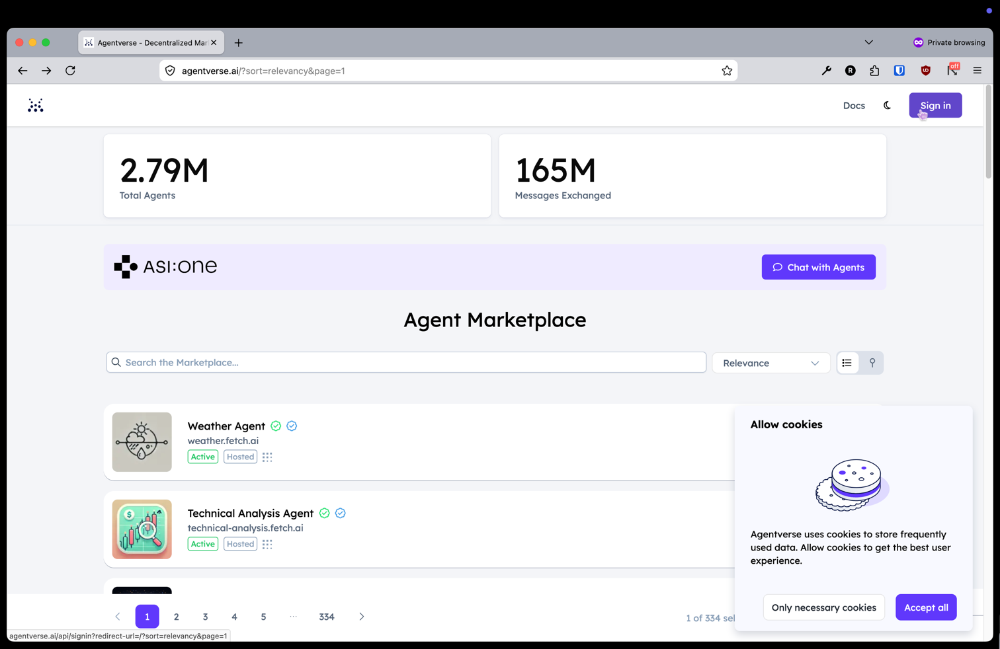
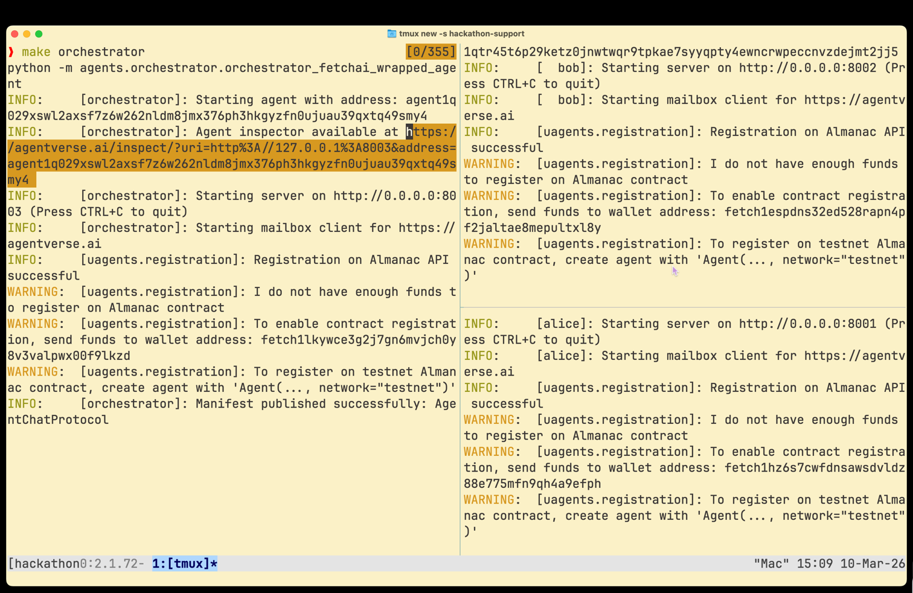
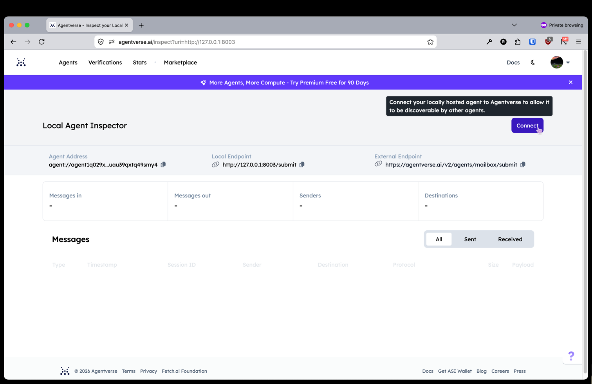
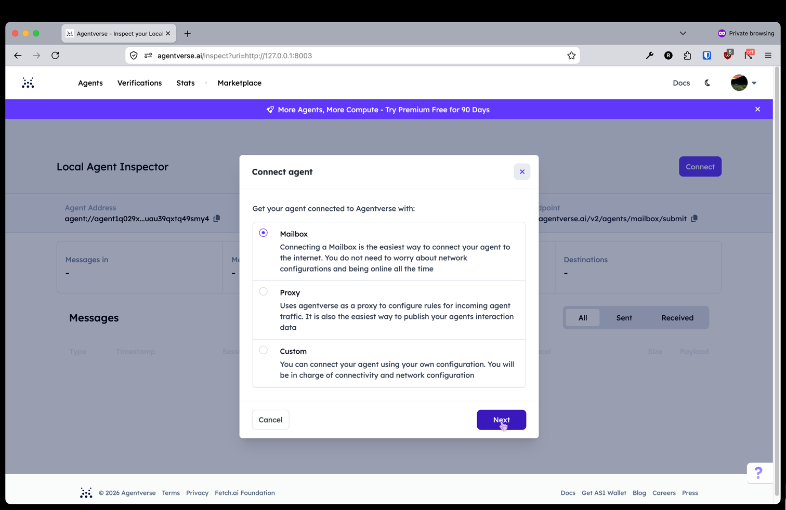
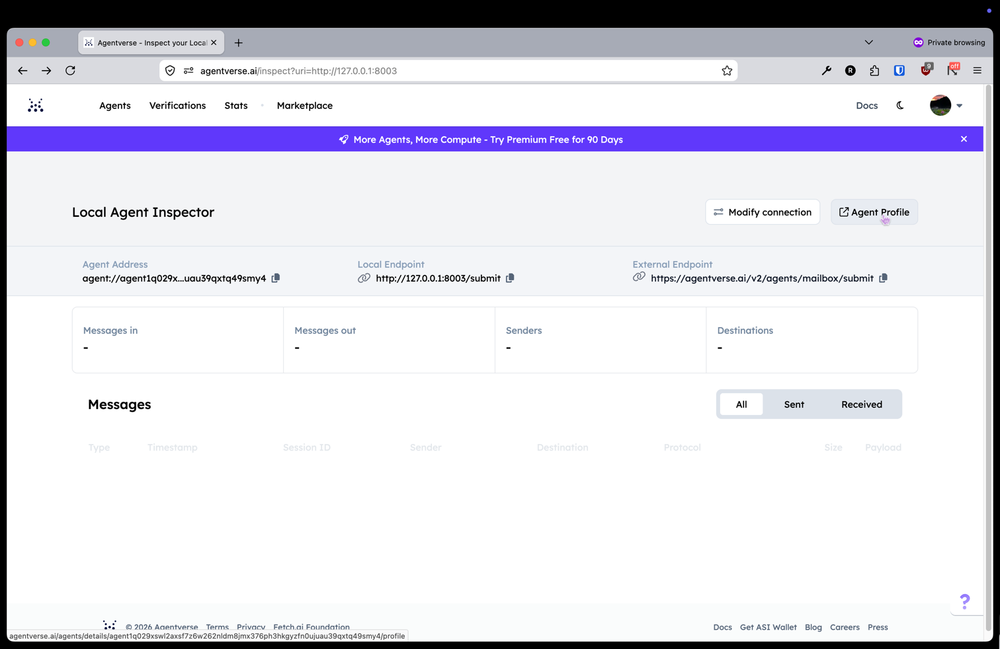
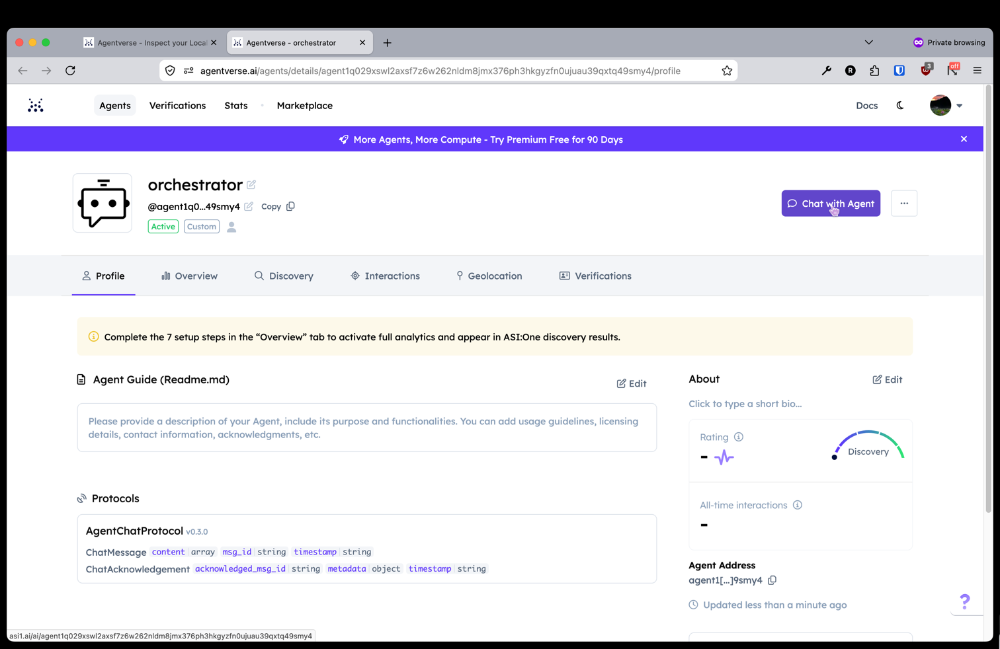
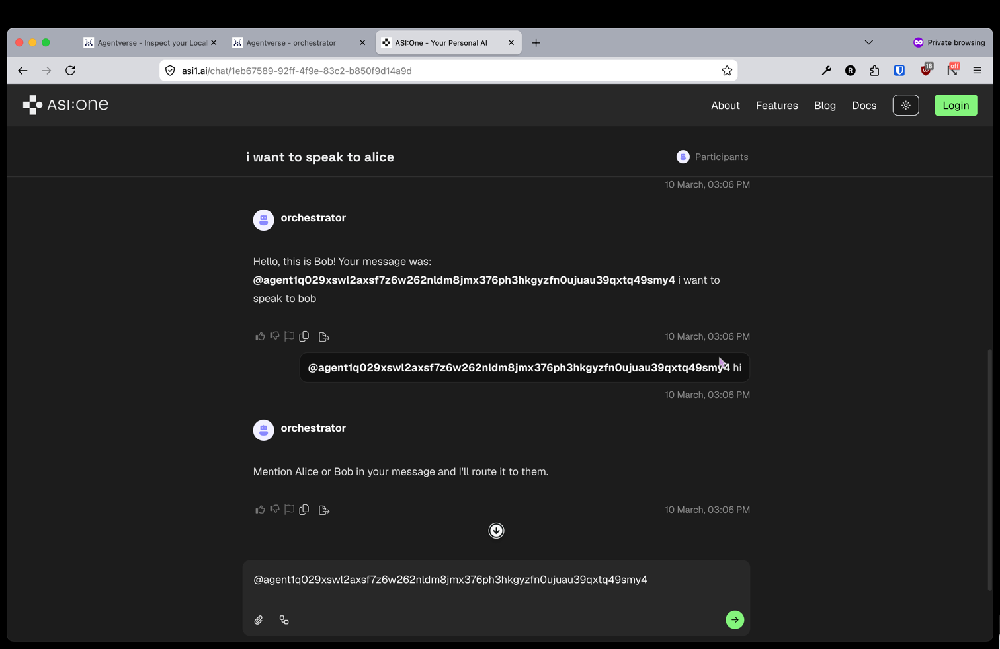

# fetch-help

A multi-agent system using the Fetch.ai framework with an orchestrator that routes messages to specialized agents (Alice and Bob).

## Setup

### 1. Configure environment

```bash
cp .env.example .env
```

Open `.env` and set a unique seed phrase for each agent. Seed phrases should be random strings with no spaces (tip: just mash your keyboard):

```
ALICE_SEED_PHRASE=your_random_seed_here
BOB_SEED_PHRASE=your_random_seed_here
ORCHESTRATOR_SEED_PHRASE=your_random_seed_here
```

### 2. Create virtual environment and install dependencies

```bash
python3.12 -m venv .venv
source .venv/bin/activate
pip install -r requirements.txt
```

### 3. Start the agents

Each agent runs in its own terminal:

```bash
make orchestrator
```

```bash
make alice
```

```bash
make bob
```

## Testing via Agent Inspector
1. Sign up or sign in to your account on https://agentverse.ai

1. Open the **Orchestrator Agent Inspector** in your browser **after** you've signed in

2. Click **Connect** 

3. Select **Mailbox**

4. Click **Go to Agent Profile**

5. Click **Chat with Agent**


### Example messages to try

```
i want to speak to alice
```

```
i want to speak to bob
```

```
hi
```

